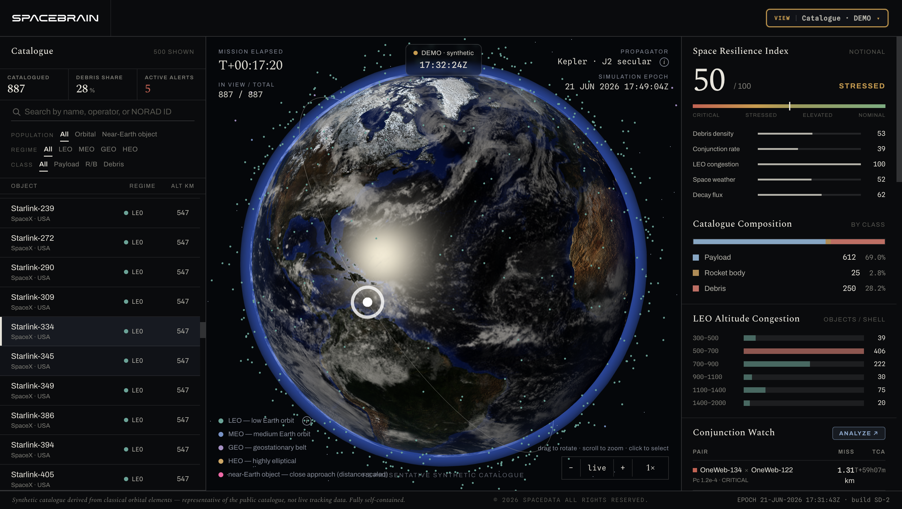

# SPACEBRAIN — DEMO

**A browser-based demo of SPACEBRAIN - AI Platform for Integrated Space Monitoring.**

[](./LICENSE)


<p align="center">
  
</p>

SpaceBrain is an AI platform for integrated space monitoring — it monitors, analyzes, and predicts space‑domain threats (satellites, debris, rockets, asteroids, and space weather) to support space security and resilience. **This repository is a self‑contained, front‑end‑only DEMO** of the catalogue dashboard: a textured 3D Earth with a synthetic satellite catalogue, a catalogue list, and SSA analytics — running entirely in the browser with **no backend and no network access**.


---

## Features

- **3D Earth view** — NASA day / night‑lights / clouds textures with atmosphere glow, real‑time day‑night terminator, rotation, and ocean sun‑glint. Drag to rotate, scroll to zoom.
- **Synthetic satellite catalogue (~887 objects)** — propagated every frame with Kepler + J2 secular terms; includes the ISS, major constellations (Starlink, OneWeb, …), navigation and geostationary satellites, debris clouds, and rocket bodies.
- **Orbit‑regime & NEO color coding** — consistent across the 3D points, the list dots, and the legend (LEO `#57a597`, MEO `#6f93c9`, GEO `#a98fc7`, HEO `#d3a45a`, NEO `#ff5ea8`).
- **Search & filters** — by name / operator / NORAD ID, plus Population (All / Orbital / Near‑Earth object), Regime, and Class.
- **Object selection & details** — click a list row or a 3D point to highlight its orbit ellipse and ground track and open a slide‑over with element / velocity / sub‑point details.
- **SSA analytics panels** — Space Resilience Index, Catalogue Composition, LEO Altitude Congestion, Conjunction Watch (with CDM **PDF export**), Orbit Anomalies, and Near‑Earth Objects.
- **Time warp** — 1×–3600× (default 100×) with a "live" real‑time mode and an HUD (mission‑elapsed, in‑view / total, propagator, simulation epoch).
- **Responsive** — desktop, tablet, and mobile layouts.
- **Fully self‑contained** — no backend, no external API or CDN calls (web fonts and Earth textures are bundled); works offline.

## Installation

### Requirements
- A modern browser with **WebGL2** and **ES Modules (import maps)** support — recent Chrome, Edge, Firefox, or Safari.
- No internet connection, runtime, or build tooling required.

### Download
Clone the repository, **or** download a ZIP from GitHub (**Code → Download ZIP**) and extract it. Note the resulting folder name:

```bash
# Clone → folder: core
git clone https://github.com/spacebrain-oss/core.git
cd core

# ZIP download → folder: core-main
#   cd core-main
```

### Run
This app uses **ES Modules + import maps**, which most browsers block under the `file://` scheme. From the project folder, **serve it over HTTP** with any static file server:

**Option A — Python (built-in; no extra install)**

```bash
# macOS / Linux
python3 -m http.server 8000

# Windows
python -m http.server 8000
```

Then open <http://localhost:8000/>.

**Option B — Node.js**

```bash
npx serve .
# or
npx http-server -p 8000
```

**Option C — VS Code:** right-click `index.html` → "Open with Live Server".

## Getting Started

1. Open the app — a rotating 3D Earth appears with the synthetic satellite point cloud already animating.
2. **Rotate** by dragging; **zoom** with the scroll wheel.
3. **Select an object**: click a row in the left **Catalogue** list (or a point in the 3D view) to show its orbit, ground track, and a details slide‑over.
4. **Filter**: use *Population / Regime / Class* and the search box to narrow the catalogue (NEO markers toggle with the Population tabs).
5. **Analyze**: open the right‑rail panels; use `Analyze ↗` for detail modals, and export a CDM as `.pdf` from a Conjunction's detail.
6. **Change time rate**: use the bottom time‑bar (−/+) to set the warp factor, or `live` for real time.

## Going further

- **Full platform:** the complete SpaceBrain platform (live catalogues, conjunction screening, planetary defence, re‑entry / impact simulations, and more) is at **https://spacebrain.org/**. This DEMO contains only the synthetic catalogue dashboard.
- See [**Not included**](#not-included) for the features intentionally excluded from this bundle.

## Getting help

- Open an **Issue** on this repository for bugs or questions about the demo.
- For the full platform, see https://spacebrain.org/.

## Build & Run locally

There is **no build step** — the app is plain HTML / CSS / JavaScript (ES Modules) with vendored libraries. To run or modify it locally, edit the files and serve the folder with any static server (see [Run](#run)).

## Download

- **Latest:** the `main` branch of this repository (ZIP or `git clone`).
- Drop the folder onto any static host to publish it (build‑free): GitHub Pages, Netlify, Vercel, Cloudflare Pages, or an S3 / CDN bucket. *(Noncommercial use only — see [License](#license).)*

## Contributing

This is a noncommercial demo distribution. Issues and suggestions are welcome via the repository's issue tracker. Any use, modification, or redistribution must comply with the [License](#license) (noncommercial purposes only).

## Dependencies

All dependencies are vendored in `assets/` — nothing is fetched at runtime.

| Component | Use | License |
| --- | --- | --- |
| [three.js](https://threejs.org/) | WebGL 3D rendering (`assets/vendor/three.module.js`, `OrbitControls.js`) | MIT |
| [jsPDF](https://github.com/parallax/jsPDF) | CDM `.pdf` export (`assets/vendor/jspdf.umd.min.js`) | MIT |
| Spectral / Archivo / Spline Sans Mono | Self‑hosted web fonts (`assets/fonts/`) | SIL Open Font License 1.1 (`assets/fonts/OFL.txt`) |
| NASA Visible Earth imagery | Earth textures (`assets/earth_*.jpg`) | Public domain |

## Project structure

```
.
├── index.html              # the entire app (HTML/CSS/JS inline)
├── assets/
│   ├── vendor/             # three.js, OrbitControls, jsPDF
│   ├── fonts/              # self-hosted woff2 + OFL.txt
│   ├── earth_*.jpg         # NASA Earth textures (day/night/clouds/ocean mask)
│   └── og-image.jpg        # social preview image
├── LICENSE                 # PolyForm Noncommercial 1.0.0
└── README.md
```

## Not included

This DEMO is extracted from the full SpaceBrain app and **does not** include: LIVE real‑catalogue ingestion, real conjunction screening, the heliocentric near‑Earth swarm (SOLAR), Planetary Defence (asteroid close‑approach), missile re‑entry, or collision / breakup simulations (IMPACT / MULTI‑IMPACT).

## License

Licensed under the **PolyForm Noncommercial License 1.0.0** — see [LICENSE](./LICENSE). You may use, modify, and redistribute the software **for noncommercial purposes only**. Commercial use is not granted.
Required Notice: © 2026 SPACEDATA ALL RIGHTS RESERVED.

## Acknowledgments

- **NASA Visible Earth** — Blue Marble (day), Black Marble 2012 (night lights), and Blue Marble clouds; the ocean specular mask is derived from the NASA Blue Marble day map. NASA imagery is in the public domain (usage guidelines: https://www.nasa.gov/nasa-brand-center/images-and-media/ ).
- **three.js** and **jsPDF** (MIT), and the **Spectral / Archivo / Spline Sans Mono** typefaces (SIL OFL 1.1).
